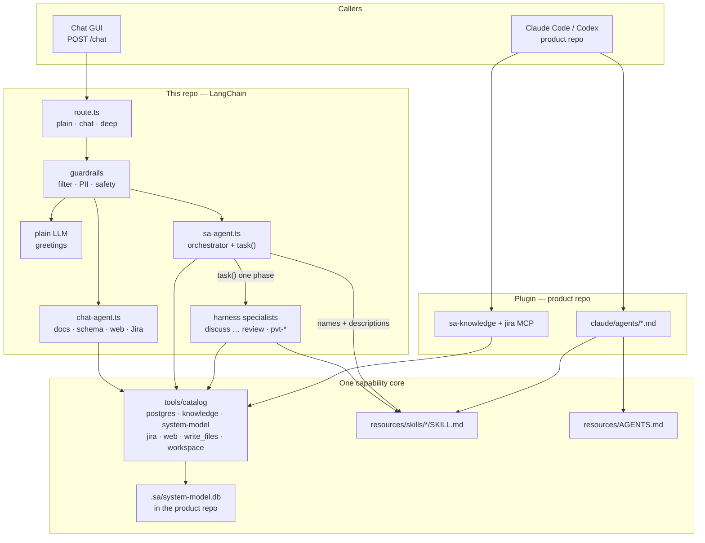
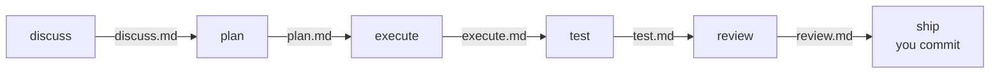
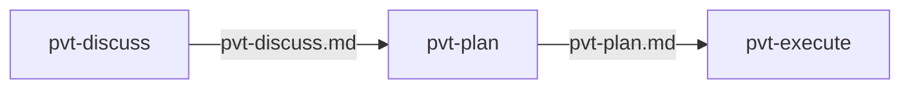
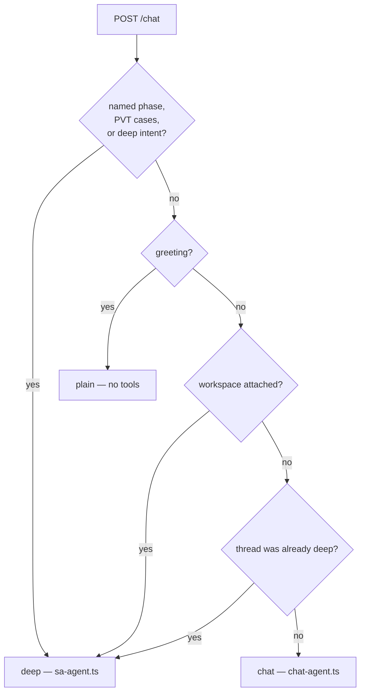
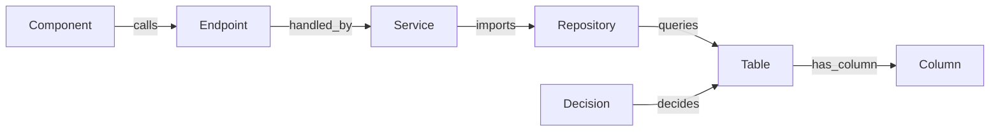
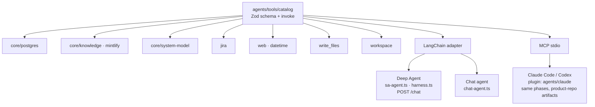
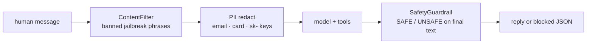

# Architecture: harness loop

sa-agent is a **capability provider**, not the product you are analysing. The
LLM runtime either sits in this repo (chat GUI) or in a **product workspace**
(Claude Code or Codex, via the plugin). Tools, skills, memory, and guardrails
live here.

The core is a six-phase loop. Each phase receives declared inputs only
(index hits, live schema, previous artifact), produces one file, and stops
at a human gate. Distillation at phase N is what makes phase N+1 cheap.

Read [`harness.ts`](../backend/agents/harness.ts) first. That file is the contract.
[`route.ts`](../backend/agents/route.ts) decides which graph a GUI turn actually
runs. [`guardrail/guardrail.ts`](../backend/agents/guardrail/guardrail.ts) wraps
every graph.

## System



## Why a harness (not one model)

A single Sonnet that discusses, plans, codes, and reviews burns context and
money. The orchestrator is a cheap router. Each phase is a specialist on a
small, fast model. Tools stay narrow so the specialist cannot wander.

| Phase | Specialist | Default model (LangChain) | Claude Code | Gate |
| --- | --- | --- | --- | --- |
| **discuss** | `discuss` / `system-analyst` | haiku | haiku | human |
| **plan** | `plan` / `solution-architect` | haiku | haiku | human |
| **execute** | `execute` / `coder` | `ollama:qwen2.5-coder` | haiku (swap to qwen) | human |
| **test** | `test` / `test-engineer` | haiku | haiku | human |
| **review** | `review` / `reviewer` | haiku | haiku | human |
| **ship** | human | — | — | human |

Override with `AGENT_ORCHESTRATOR_MODEL`, `AGENT_DISCUSS_MODEL`,
`AGENT_PLAN_MODEL`, `AGENT_EXECUTE_MODEL`, `AGENT_TEST_MODEL`,
`AGENT_REVIEW_MODEL` (`provider:model`).

The PVT prep track below has its own three: `AGENT_PVT_DISCUSS_MODEL`,
`AGENT_PVT_PLAN_MODEL`, `AGENT_PVT_EXECUTE_MODEL`.

## The loop



Each arrow is a **human gate**. There is no `/start` command. The artifact
file **is** the interface.

| Phase | Receives | Produces | You do |
| --- | --- | --- | --- |
| **discuss** | request, optional ticket, index, live schema | gaps, field map, questions | approve or answer gaps |
| **plan** | approved discuss | spec, Mermaid, execute checklist | approve the plan |
| **execute** | approved plan | code + execute notes | accept the change |
| **test** | discuss + plan + execute | cases, quiz, gaps | accept coverage |
| **review** | plan + execute + test | findings, ship-ready? | accept or send back |
| **ship** | accepted review | commit / PR | you ship |

## The PVT prep track

Preparing a Production Verification Test is a **second track**, not more phases
on the first. It ends in SQL scripts another team runs against production, so
it never reaches execute-the-code or review-the-diff. `PVT_PHASES` /
`PVT_PHASE` in [`harness.ts`](../backend/agents/harness.ts).



| Phase | Specialist (LangChain / Claude Code) | Receives | Produces |
| --- | --- | --- | --- |
| **pvt-discuss** | `pvt-discuss` / `pvt-analyst` | requirements + a case list (CSV, table, or a named story) + live schema | case inventory, tables touched, unrunnable cases, questions |
| **pvt-plan** | `pvt-plan` / `pvt-planner` | approved pvt-discuss | scenario groups, script set, pre-window vs in-window split, impact |
| **pvt-execute** | `pvt-execute` / `pvt-scripter` | approved pvt-plan | the numbered SQL scripts, run order, owners |

Two constraints shape the whole track:

1. **The window is the scarce resource.** Data that could have been staged
   before it must not be created inside it — that is what pvt-plan's
   pre-window / in-window split is for.
2. **Every SRE round trip costs the window.** Grouping cases into the fewest
   shared setups is the point of the planning phase, not a nicety.

Scripts are `NN-<action>[-pvt-NN]_<owner>.sql`, owner `devops` or `sre`,
numbers unique and ascending in run order, `_(optional)` on the rollbacks:

```
01-setup-db_devops.sql   02-seed-db_sre.sql        03-patch-data_sre.sql
04-patch-data-pvt-01_sre.sql   05-patch-data-pvt-02_sre.sql
06-clear-data-pvt_sre.sql
08-rollback_devops_(optional).sql   09-rollback_sre_(optional).sql
```

No phase in this track should mutate the database through the agent.
`run_sql` can DML when human-gated, but PVT still emits scripts for SRE —
`run_sql` only proves verification queries; the scripts are artifacts, and a
human runs them. The convention lives in `skills/pvt-prep/SKILL.md`.

The chat GUI sends `POST /chat` with `Accept: text/event-stream` and renders
tokens and tool steps as they stream. `Accept: application/json` still returns
one artifact (`text` / `api_spec` / `sql` / `diagram` / `code`). The orchestrator
does not write the product repo. Claude Code writes `docs/sa/<phase>.md` in the
product repo. The GUI writes `/artifacts/<phase>.md` in thread state; execute /
review / pvt-execute may also write an attached local folder.

## GUI routing

[`route.ts`](../backend/agents/route.ts) picks a graph **before** the model
runs. A miss is the tool chat, not the harness.



| Kind | Graph | Tools | Skills |
| --- | --- | --- | --- |
| **plain** | one LLM call | none | optional `caveman` voice |
| **chat** | ReAct `createAgent` | docs, schema, `run_sql`, datetime, web, Jira | `chat` body in the prompt; `caveman` on chat turns only |
| **deep** | Deep Agent | orchestrator set + `task()` specialists | skill **names** on the router; full packages on the specialist |

A greeting after a harness turn drops back to plain. A follow-up that is not
small talk stays on the Deep Agent. Style (`/caveman`) is not deep intent.

## The system model

A third grounding source, next to the live schema and the index. The schema
knows what exists; the index knows what someone wrote down; the system model
knows **what connects to what**, and the decision records know **why**.



Every edge points **dependent → dependency**. Impact analysis is therefore one
reverse-reachability query, with no per-edge special cases:

```
simulate_impact("orders.user_id")
  → column ← table ← repository ← service ← endpoint ← frontend component
                                        ↑
                                     tests, docs, decisions
```

It lives in [`model/`](../backend/agents/model) and stores to `.sa/system-model.db` in the
**product** repo, next to `.sa/decisions/*.md`. The graph is derived, so it is
gitignored; the decisions are not, so they are committed and reviewed.

The scan is pattern matching, not a compiler — deterministic, free, polyglot,
and re-runnable on every commit. The trade is recall: a route registered
through a factory is invisible. Two rules keep it honest:

1. A table found in SQL but absent from the live schema is **reported**, never
   added as a node. "Never invent a table" becomes an invariant of the build.
2. Nothing in the graph is inferred by a model, so two builds of the same
   commit are byte-identical.

| Phase | Uses it for |
| --- | --- |
| discuss | `build_system_model`, then find the real components and any decision that constrains them |
| plan | `simulate_impact` on everything the change touches; the plan carries an **Impact and risk** section |
| execute | stay inside the declared blast radius; rebuild after; `record_decision` when the human gives a reason |
| test | affected files with no test are the coverage gap list |
| review | a change that reverses a recorded decision without arguing against it is critical |

## Context management

The index is live Mintlify (`search_docs` → titles, `get_doc_page` → full
pages) plus DDL Chroma (`search_schema_docs`). Do not add another vector store
for API specs.

1. Orchestrator retrieves a short brief → `/artifacts/context.md`
   (Claude Code: a few lines in the task, or `docs/sa/context.md`).
2. Specialist reads that brief plus the previous phase file.
3. Specialist writes its artifact. Raw tool dumps stay in that thread and
   die with it.
4. Next phase reads the file, not the conversation.

Live schema orientation (`list_tables`, `describe_tables`,
`inspect_relationships`) is on the router so it can finish a brief without
asking the human for columns. `run_sql` stays inside the specialist (and on
the GUI chat agent for lookup questions).

Jira is Discuss / PVT-discuss only, and only when a ticket or story is named —
except the GUI **chat** agent, which may call Jira when the user names a
ticket without entering the harness.

When a local project folder is attached, `workspace_ls` / `workspace_read` /
`workspace_grep` (and Deep Agents `ls` / `read_file` / `glob` / `grep` from
`/`) see that repo. `/artifacts` and `/vault` stay in thread state.

## Two runtimes, one tool core



## Skills

Source of truth: [`agents/resources/skills/`](../backend/agents/resources/skills/).
Plugin `claude/skills/` is a symlink into that tree (`grill-me` is plugin-only).

deepagents lists **children** of each skills source as packages. `PHASE.skills`
names the package (`/resources/skills/backend/`); the source is its parent.
The GUI orchestrator mounts `/skills/` so it can **name** the right package in
the `task()` it hands a specialist. It does not read skill bodies or do the
work. Specialists load only the packages in their `PHASE` / `PVT_PHASE` row.

| Skill | Who loads it |
| --- | --- |
| `system-analyst` | discuss, pvt-discuss |
| `solution-architect` | plan |
| `backend`, `backend-go`, `frontend` | execute, review (frontend when the change is the web app); pvt-plan / pvt-execute use `backend` |
| `backend-code-review` | plan (design gate), review |
| `security-review` | review (auth, SQL, secrets, uploads, browser) |
| `test-engineer` | test, pvt-plan |
| `system-model` | discuss, plan, execute, test, review |
| `jira` | discuss, pvt-discuss (when a ticket is named) |
| `pvt-prep` | all three PVT phases |
| `chat` | GUI chat agent (prompt body, not Deep Agents skills middleware) |
| `caveman` | GUI chat/plain voice; never on harness specialists |

**New skill** — `agents/resources/skills/<name>/SKILL.md` only, then grant it
on a phase in `harness.ts`. The plugin path is a symlink.

## Guardrails

Every GUI graph (plain, chat, deep, and each specialist) runs
[`guardrailsForModel`](../backend/agents/guardrail/guardrail.ts). Layers, in
order:



1. **Before-agent filter** — blocks the turn when the latest human message
   contains a jailbreak phrase. `hack` / `exploit` stay allowed so architecture
   questions about auth still run.
2. **PII** — redacts email, credit-card, and `sk-` API keys on input, output,
   and tool results.
3. **After-agent safety** — a second pass of the same chat model judges the
   final AI text. `UNSAFE` is replaced with a blocked text artifact.

HITL is **not** in this stack on live agents. Interrupt maps live on the Deep
Agent (`interruptOn` in `builder.ts` / `harness.ts`).

Filesystem permissions are a second fence: discuss / plan / test may write
`/artifacts`, `/vault`, and scratch paths only; execute / review / pvt-execute
may write the attached product repo but never `/resources/**` (skills and
memory).

## Deep Agent (GUI / `/chat`)

[`harness.ts`](../backend/agents/harness.ts) + [`sa-agent.ts`](../backend/agents/sa-agent.ts):

1. **Orchestrator model** — haiku. Tools: index + schema orientation
   (`list_tables`, `describe_tables`, `inspect_relationships`), `write_files`,
   workspace reads. No `run_sql`, no Jira.
2. **Skills** — names + descriptions of every package under `resources/skills/`
   so the router can pick the right one for the specialist. Bodies stay unread.
3. **`task`** — Deep Agents delegation. One specialist per gate.
   `PHASE_OWNERS` is derived from `PHASE` + `PVT_PHASE`; `ship` has no owner.
4. **Scratch files** — `/artifacts/*.md` on the per-thread StateBackend. When a
   project folder is attached, reads from `/` see that repo; `/artifacts` stays
   in state. Vault files mount at `/vault`.
5. **Memory** — **off** on the GUI orchestrator (`memory: false`). The loop
   rules are already in `SA_AGENT_PROMPT`. Specialists inherit
   [`GROUNDING`](../backend/agents/specialists/types.ts). Plugin sessions still
   load `resources/AGENTS.md`.
6. **JSON contract** — [`contract/chat-response.ts`](../backend/contract/chat-response.ts); the orchestrator prompt is generated from it.
7. **Checkpointer** — one `MemorySaver` for every Deep Agent model id, so
   switching model mid-thread keeps history. The chat agent has a **separate**
   saver (different state schema; a shared `thread_id` would clobber).

## Plugin runtimes (product repo)

Plugin under [`claude/`](../backend/agents/claude/), installed from a marketplace manifest at
the repo root: `.claude-plugin/marketplace.json` for Claude Code,
`.agents/plugins/marketplace.json` for Codex.

| Piece | Role | Runtime |
| --- | --- | --- |
| `.claude-plugin/plugin.json` | plugin identity | Claude Code |
| `.codex-plugin/plugin.json` | plugin identity + install metadata | Codex |
| `.mcp.json` | sa-knowledge + jira, spawned at `${SA_AGENT_HOME}` | Claude Code |
| `.mcp.codex.json` | same servers via [`mcp/sa-mcp`](../backend/mcp/sa-mcp) | Codex |
| `agents/*.md` | discuss / plan / execute / test / review, plus the three `pvt-*` | Claude Code |
| `memory/AGENTS.md` | loop + grounding at SessionStart | both |
| `skills/*/SKILL.md` | how each specialist works | both |

In Claude Code you pick `/agents` for the phase. In Codex there are no plugin
subagents, so you invoke the skill (`$system-analyst`) and drive execute and
review yourself. Either way: write `docs/sa/<phase>.md`, approve, then the next
specialist.

Codex passes plugin MCP arguments verbatim and gives those servers a core
environment only, which is why it cannot use `${SA_AGENT_HOME}` in `.mcp.json`.
`mcp/sa-mcp` resolves the checkout (`$SA_AGENT_HOME`, then
`~/.sa-agent/home`, then its own location) and locates `bun`.

## Grounding order (every specialist)

1. Live database.
2. System model (as current as the last `build_system_model`).
3. Live Mintlify docs (`search_docs` / `get_doc_page`) and DDL snapshots.
4. Jira only in discuss (and GUI chat), only when named.

Never invent a table, column, or endpoint.

## Milestones (you implement)

The core above is **M0**. Do these in order. Each one is a small, testable
change. Do not skip ahead to ship automation.

### M1 — Discuss + Align

In a product repo: name a ticket, run `system-analyst`, get
`docs/sa/discuss.md` with real columns and a gap list. Approve or answer.
Confirm Jira is not called from plan/execute.

### M2 — Plan

From the approved discuss file, run `solution-architect`. Require a
Mermaid flow and a numbered execute checklist in `docs/sa/plan.md`.
Reject plans that invent endpoints.

### M3 — Execute on a cheap coder

Set `AGENT_EXECUTE_MODEL=ollama:qwen2.5-coder` (or qwen3) after `ollama pull`.
In Claude Code, point the coder agent at that model if you have it
configured. Coder may only implement the checklist. If a step is missing,
it stops.

### M4 — Test / Validate

`test-engineer` reads discuss + plan + execute, writes `docs/sa/test.md`,
and adds tests in the product runner. Include a short quiz: each spec
rule either has a test or is listed as a gap.

### M5 — Review

`reviewer` writes `docs/sa/review.md`. You decide ship-ready. Send back to
execute or test; do not let review commit.

### M6 — Ship (human)

You commit and open the PR. Do not add an agent for this.

### M7 — System model in the loop

`bun run model:build` in a product repo. Confirm the endpoint paths match the
routes you actually serve, and that the "referenced in code but absent from the
live schema" list is empty or explainable. Then require every `plan.md` to
carry an **Impact and risk** section produced by `simulate_impact`, and record
the first decision the next time someone asks "why is it like this".

### M8 — Hard HITL + stream of thought

The chat GUI sends `Accept: text/event-stream` on `POST /chat`. The agent
**streams** (`messages`, `updates`, `values`, subgraphs) so tokens and tool
steps appear as they run. Sensitive tools pause via Deep Agents `interruptOn`
(`task`, `write_files`, `workspace_write`, `write_file`, `edit_file`,
`record_decision`, `build_system_model`, `run_sql`). The GUI shows the
pending actions (args, scope, cost hint) and resumes with
`POST /chat/resume` `{ threadId, decisions }` (`approve` / `edit` / `reject`).

Read-only grounding tools auto-run. `Accept: application/json` still returns
one `{ ok, threadId, type, data, artifacts, usage }` blob and auto-approves
interrupts so scripts do not hang.

The prompt gate (stop and wait between phases) remains the loop. HITL on
`task` is the in-turn gate so a specialist does not start until the human
says so.

## Adding capabilities

One edit. Generated plugin files and the frontend contract are refreshed with
`bun run surfaces` in `backend/` (`bun run check:surfaces` fails if they drift).

- **New tool** — implement in `agents/tools/core/`, add one row to
  `agents/tools/catalog/` with `surfaces` (`langchain`, `mcp-knowledge`,
  `mcp-jira`). LangChain and MCP pick it up from the catalog. Grant it on a
  phase in `harness.ts` if specialists should call it.
- **New node or edge kind** — `agents/model/types.ts` plus the pass in
  `model/scan.ts` or `model/schema.ts`. Shared core; both runtimes call it.
- **New Jira tool** — catalog row with `surfaces: ["langchain", "mcp-jira"]`
  and an invoke that uses `resources/mcp/jira-api.ts`.
- **New skill** — `agents/resources/skills/<name>/SKILL.md` only, then a
  `PHASE.skills` (or `PVT_PHASE.skills`) grant. The plugin path is a symlink
  into that directory.
- **Memory / loop** — `agents/resources/AGENTS.md` only (`claude/memory/` is a
  symlink). GUI orchestrator does not auto-load it; keep `SA_AGENT_PROMPT` and
  `GROUNDING` in sync when the loop rules change.
- **New phase** — a specialist in `agents/specialists/` plus a `PHASE` /
  `PVT_PHASE` row in `harness.ts`. `claude/agents/*.md` is generated.
- **New chat artifact kind** — add a variant to
  `backend/contract/chat-response.ts`. Prompt text and
  `frontend/lib/chat-response.ts` follow from `bun run surfaces`.
- **New MCP server** — add it to the template in `backend/scripts/surfaces.ts`
  (writes `.mcp.json` and `.mcp.codex.json`).
- **Guardrail change** — `agents/guardrail/guardrail.ts`. Live agents call
  `guardrailsForModel`; do not bolt a second filter onto `POST /chat`.

Copy-paste starters: [`templates/`](../backend/agents/templates/).
