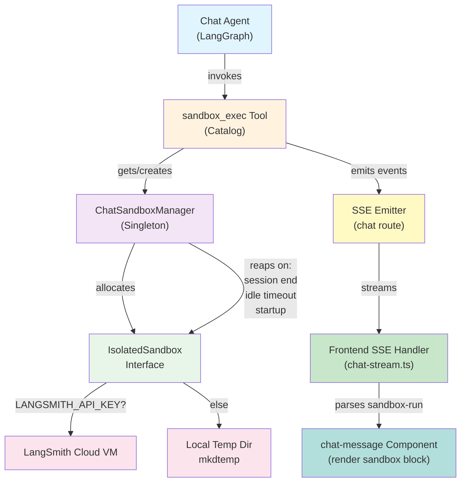
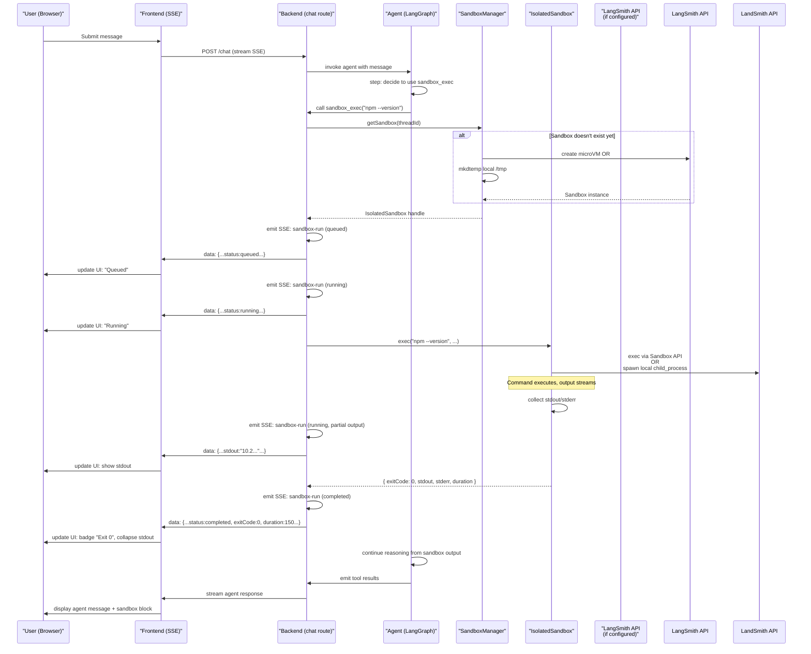

# Sandbox Execution Environment + next-devtools-mcp Plan

## Overview

Extend the existing `IsolatedSandbox` abstraction from `backend/agents/evaluators/sandbox.ts` into a shared service (`backend/internal/sandbox/`) that supports code execution. Add a `sandbox_exec` tool to the chat agent's catalog that runs commands in an ephemeral, per-session sandbox environment—either in a LangSmith cloud microVM (when `LANGSMITH_API_KEY` is set) or in a local temp directory (fallback). Stream execution output inline in the chat UI as a collapsible block. Register `next-devtools-mcp` as an MCP server in both the backend agent's MCP client (so agents can inspect the running Next.js dev server) and in `.mcp.json` for Claude Code's own use.

## Design Decisions

### 1. Sandbox Runtime: Extend LangSmith Path
**Decision:** Promote `evaluators/sandbox.ts` to a shared service at `backend/internal/sandbox/`, exposing both the read/write primitives and a new `exec(command, options)` method. Keep the LangSmith cloud microVM as the primary runtime when `LANGSMITH_API_KEY` is set; fall back to local `mkdtemp` when not.

**Alternatives considered:**
- Docker containers (rejected: adds heavyweight dependency, violates "no new deps" constraint)
- Direct child_process spawning (rejected: unsafe for model-authored code, no resource limits)
- Pod exec over Kubernetes (rejected: requires cluster, not dev-friendly)

**Why this wins:** Reuses existing LangSmith integration (already used in evaluators), keeps code changes localized (migrate evaluators' imports once), and provides a clear safety boundary (cloud microVM vs. local fallback with warnings).

**Verified LangSmith exec API** (read from `backend/node_modules/langsmith/dist/sandbox/` at v0.9.0 — not inferred):

```ts
const handle = await sandbox.run(command, { timeout: 600, wait: false });
for await (const chunk of handle) { /* OutputChunk: stdout+stderr, arrival order */ }
const result = await handle.result;   // ExecutionResult: { exit_code, stdout, stderr }
handle.kill();                        // SIGKILL to the whole process group
handle.sendInput(data);               // write to stdin
```

`run()` also accepts `onStdout` / `onStderr` callbacks and `stdoutOffset` / `stderrOffset`. `CommandHandle` is async-iterable with auto-reconnect (immediate on server hot-reload, exponential backoff on network error, none after `kill()`), and `handle.reconnect()` resumes from the last byte offsets.

**Implication for the streaming design:** map `OutputChunk` directly onto the `sandbox-run` SSE event — one chunk in, one event out. Do not buffer to completion and emit once; that discards the streaming the SDK already gives us. `exit_code` comes from `await handle.result`, so the terminal event is naturally distinct from the chunk events. Open Question 6 (line-vs-chunk granularity) is therefore settled by the SDK: emit per `OutputChunk`.

**Consequences:** 
- Evaluators must import from `backend/internal/sandbox/` instead of `backend/agents/evaluators/`. Re-export in evaluators for backward compatibility OR migrate imports. (Specify in checklist.)
- The local `mkdtemp` fallback has **no** equivalent of `CommandHandle` and must hand-roll one over `Bun.spawn` to satisfy the same interface. This is the single largest piece of new code in the plan and the checklist must treat it as such — the two runtimes are not symmetric.
- Local fallback runs as the developer's own user—weaker boundary than cloud. Plan must state this and recommend gating it.
- `LANGSMITH_API_KEY` absence gracefully downgrades to local temp-dir (no hard error).

### 2. Session Lifecycle: Ephemeral Per-Thread Sandbox
**Decision:** One `IsolatedSandbox` instance per chat thread (identified by `threadId`), created lazily on first `sandbox_exec` call, owned by a `ChatSandboxManager` singleton that stores handles keyed by thread. Reaped on: (a) explicit session end event, (b) 30-minute idle timeout, (c) backend restart (orphan cleanup in startup).

**Alternatives considered:**
- Sandbox per tool invocation (rejected: violates "state isolation"—successive commands cannot build on prior work)
- Global singleton sandbox (rejected: cross-session leakage, thread-unsafe)
- Shared workspace directory (rejected: violates decision #2 scope boundary)

**Why this wins:** Aligns with LangSmith trial lifetime (one VM per run), matches user expectation ("my sandbox" for this conversation), and avoids state bleed across sessions.

**Consequences:** 
- `ChatSandboxManager` must live in `backend/internal/sandbox/manager.ts`, track by `threadId`, and integrate with the chat lifecycle.
- Session end must call `manager.reap(threadId)` explicitly—requires hooking into `backend/routes/chat.ts` or `backend/internal/chat/execute.ts`.
- Idle cleanup requires a background task (e.g., setInterval in manager, or a cron-like watcher).

### 3. Boundary: Workspace Isolation
**Decision:** The sandbox root (`/tmp/sa-eval-{sessionId}` locally, or `/tmp/sa-eval-{name}` on LangSmith) is **completely separate** from the attached workspace root (stored in `AsyncLocalStorage` in `backend/internal/workspace/runtime.ts`). Tools available in the sandbox (e.g., `sandbox_exec`) may NOT read or write the workspace directory. The `middleware/normalize-virtual-fs-paths.ts` middleware does not apply inside the sandbox context.

**Why:** Model-authored code in the sandbox is less trustworthy than the attached workspace (which the user controls). Prevents accidental/malicious exfiltration of project files.

**Implementation:**
- `sandbox_exec` accepts only relative paths within the sandbox root.
- Path validation: reject any path containing `../` or `/` at the start.
- Workspace root is NOT injected into the sandbox environment or available in `$WORKSPACE_ROOT` or similar.
- Evaluators that use `withWorkspaceRoot()` do so *outside* the sandbox context (they are not tools; they run during evaluation).

### 4. Frontend: Streaming Sandbox Output Inline
**Decision:** Ride the existing SSE streaming path. Add a new event type `sandbox-run` that flows through the chat response stream with command, status (queued/running/completed/error), stdout/stderr lines, exit code, and duration. Render in `chat-message.tsx` as a collapsible `<details>` or accordion block.

**Alternatives considered:**
- New `/sandbox` tab page (rejected: violates "inline in chat" constraint)
- Polling a sandbox-status endpoint (rejected: adds latency, doesn't fit SSE model)
- Storing output in artifacts (rejected: bulky for real-time output, no streaming benefit)

**Why this wins:** No new page, no polling, leverages existing streaming infrastructure, and output is co-located with the agent's message context.

**Consequences:**
- Must add `SandboxRunEvent` to `backend/contract/chat-response.ts` and update the type union.
- `frontend/lib/chat-response.ts` must parse the new event type.
- `frontend/components/chat-message.tsx` must render it; template: command line, collapsible stdout/stderr region, exit code badge, elapsed time.

### 5. next-devtools-mcp: Dual Registration
**Decision:** Register `next-devtools-mcp` in two places:
1. **Backend agent:** Add to `backend/agents/resources/mcp/mcp-client.ts` alongside `getJiraMcpClient()`, creating a `nextDevToolsMcpClient()` that launches `npx next-devtools-mcp@latest` with stdio transport. Enable it unconditionally (unlike Jira, which is config-gated).
2. **.mcp.json:** Add an entry so Claude Code itself (when invoked on the frontend repo) can use it. Config: `{"command": "npx", "args": ["-y", "next-devtools-mcp@latest"]}`.

**Alternatives considered:**
- Jira-style config gate (e.g., `NEXT_DEVTOOLS_MCP_ENABLED`) (rejected: it's a free local discovery tool, no reason to gate)
- Embed next-devtools-mcp as a dependency instead of `npx` (rejected: tight coupling, adds to lock files)

**Why this wins:** Auto-discover running `next dev` server, minimal config burden, works immediately if the dev server is up, and extends agent capability without additional setup.

**Consequences:**
- Requires `npx` to be available (standard in modern Node setups).
- **Must document:** "To use sandbox inspection and next-devtools-mcp, run `npm run dev` in the frontend directory on the same machine."
- If `next dev` is not running, MCP connection fails gracefully (no impact to chat agent; it just can't inspect Next.js state).
- `next-devtools-mcp` discovers on `localhost:3000` (Next default), and ports 3001–3010 for multiple instances.

---

## Specification

### Tool Contract: `sandbox_exec`

**Input Schema (Zod):**
```typescript
const sandboxExecSchema = z.object({
  command: z.string().describe("Shell command to run (e.g., 'ls -la' or 'bun --version')"),
  cwd: z.string().optional().describe("Working directory relative to sandbox root (default: '.')"),
  timeout: z.number().optional().describe("Timeout in milliseconds (default: 30000, max: 120000)"),
  env: z.record(z.string()).optional().describe("Additional environment variables"),
  input: z.string().optional().describe("Stdin to pipe to the command"),
});
```

**Output Format:**
```typescript
{
  success: boolean;
  stdout: string;
  stderr: string;
  exitCode: number;
  signal?: string;          // signal name if process was killed
  duration: number;         // elapsed ms
  command: string;          // echo back what was run
  cwd: string;              // working directory used
}
```

**Constraints:**
- **Timeout:** Default 30s, max 120s per invocation. Exceeding the max causes an immediate error.
- **Output cap:** Truncate stdout/stderr at 64 KB each. If truncated, suffix with `\n... [output truncated]`.
- **Non-zero exit:** Treated as a successful execution (exit code included in output), not a tool error. The agent can observe and decide.
- **Concurrency:** One command per sandbox at a time (sequential). A second invocation while the first is running will queue (via mutex in `ChatSandboxManager`).
- **Path safety:** The `cwd` path is validated to reject `../` sequences and absolute paths. Must stay within the sandbox root.

**Session Binding:**
- Derives sandbox from the chat thread context (`threadId` from `ToolContext`).
- Creates the sandbox lazily on first use.
- Command runs inside the sandbox's isolated root.

**Surfaces:** `["langchain"]` (available only to the deep agent via the chat route, not exposed as MCP).

---

## Session Lifecycle

### Initialization
1. **Per-thread on first use:** When the first `sandbox_exec` is invoked for a `threadId`, `ChatSandboxManager.getSandbox(threadId)` creates a new sandbox if missing.
   - If `LANGSMITH_API_KEY` is set: call `withLangSmithSandbox({ name: threadId })` to allocate a cloud microVM.
   - Otherwise: call `withIsolatedSandbox({ name: threadId })` to allocate a local temp dir.
2. **Ownership:** The manager holds a strong reference; the sandbox is NOT garbage collected while in use.

### Reaping
1. **Explicit:** When the chat session ends (e.g., user closes the thread), the frontend should trigger a cleanup event or the backend should hook into the turn completion and call `ChatSandboxManager.reap(threadId)`.
   - Local sandbox: `rm -rf` the temp directory.
   - LangSmith sandbox: call `remote.delete()`.
2. **Idle:** A background cleanup loop in `ChatSandboxManager` polls every 60 seconds and removes sandboxes not accessed in the last 30 minutes.
3. **Startup:** On backend restart, scan for orphaned LangSmith sandboxes (age > 1 hour) and delete them. Local temp dirs are transient (OS cleans them on reboot).

### File Organization
- **Local:** `/tmp/sa-eval-{threadId}-{randomSuffix}/`
- **LangSmith:** `/tmp/sa-eval-{threadId}/` (inside the microVM's filesystem)
- **Manager state:** `backend/internal/sandbox/manager.ts` (in-memory map: `Map<threadId, { sandbox, createdAt, lastUsedAt }>`)

---

## Streaming Contract

### New Event Type: `sandbox-run`

**Added to `backend/contract/chat-response.ts`:**
```typescript
export const sandboxRunEventSchema = z.object({
  type: z.literal("sandbox-run"),
  id: z.string(),                        // unique run ID
  command: z.string(),                   // the command executed
  status: z.enum(["queued", "running", "completed", "error"]),
  stdout: z.string().optional(),         // streamed output (may arrive in chunks)
  stderr: z.string().optional(),
  exitCode: z.number().optional(),       // only when status === "completed"
  error: z.string().optional(),          // when status === "error"
  duration: z.number().optional(),       // ms elapsed (final when completed)
  startedAt: z.number().optional(),      // unix timestamp (ms) for client-side duration calc
});
```

**Flow:**
1. Agent invokes `sandbox_exec` in `backend/agents/route.ts` or a tool callback.
2. Tool immediately returns; execution is wrapped to emit SSE events.
3. Events flow through `backend/agents/route.ts` → `backend/routes/chat.ts` → frontend SSE handler.
4. Each event is emitted as a separate SSE message with `event: "sandbox-run"`.
5. Frontend collects by `id`, updating the same run's display as status and output arrive.

**Example event stream for one sandbox run:**
```
event: sandbox-run
data: {"type":"sandbox-run","id":"run-1","command":"npm --version","status":"queued","startedAt":1696123456000}

event: sandbox-run
data: {"type":"sandbox-run","id":"run-1","command":"npm --version","status":"running"}

event: sandbox-run
data: {"type":"sandbox-run","id":"run-1","command":"npm --version","status":"running","stdout":"10.2.4\n"}

event: sandbox-run
data: {"type":"sandbox-run","id":"run-1","command":"npm --version","status":"completed","stdout":"10.2.4\n","exitCode":0,"duration":234}
```

**Backward Compatibility:** Existing event types (`step`, `values`, `usage`, etc.) are unchanged. The type union in `ChatSseEventName` grows by one.

---

## Mermaid Diagrams

### Component & Data Flow Diagram



### Sequence Diagram: Sandbox Run End-to-End



---

## Impact and Risk

### Blast Radius

**Affected Components:**
- **Backend Files:**
  - `backend/agents/evaluators/sandbox.ts` — migrate to `backend/internal/sandbox/base.ts`, re-export or update imports
  - `backend/internal/sandbox/manager.ts` — **new**, lifecycle management
  - `backend/agents/tools/catalog/` — **new tool** `sandbox_exec`, update `index.ts`
  - `backend/agents/resources/mcp/mcp-client.ts` — add `nextDevToolsMcpClient()` and wire into agent
  - `backend/routes/chat.ts` — hook sandbox cleanup on session end (if not automatic)
  - `backend/agents/route.ts` — emit SSE events for sandbox runs
  - `backend/contract/chat-response.ts` — add `SandboxRunEvent` schema
  - `.mcp.json` — **new file**, register next-devtools-mcp
  - `.env.example` — add `LANGSMITH_API_KEY` note (optional; already likely present)

- **Frontend Files:**
  - `frontend/lib/chat-stream.ts` — parse new `sandbox-run` event
  - `frontend/lib/chat-response.ts` — **generated, do not hand-edit.** Verified in `backend/scripts/surfaces.ts`: this exact path is `FRONTEND_CONTRACT`, written by `writeSurfaces()`. Regenerate with `bun run surfaces` (mode defaults to `write`); `bun run check:surfaces` only *reports* dirty files and does not fix them. So the real sequence is: edit `backend/contract/chat-response.ts` → `bun run surfaces` → commit the regenerated frontend file.
  - `frontend/components/chat-message.tsx` — render `SandboxRunPart`, update `UIMessage` to include sandbox runs
  - `frontend/features/sandbox/types.ts` — **new.** (Corrected: there is no `frontend/types.ts` in this repo. Per the established `features/<name>/{service,types}.ts` convention, the hand-written part types belong in a new `features/sandbox/` module; the generated wire types stay in `lib/chat-response.ts`.)

- **Tests:**
  - `backend/agents/evaluators/evaluator.test.ts` — update imports if sandbox.ts moves
  - **New:** `backend/agents/tools/catalog/sandbox.test.ts` — test sandbox_exec contract, path validation, timeout
  - **New:** `backend/internal/sandbox/manager.test.ts` — test lifecycle, reaping, threading
  - `backend/routes/chat.test.ts` — test SSE event emission for sandbox runs (optional but recommended)
  - Frontend: `frontend/components/chat-message.test.tsx` — test sandbox-run rendering

- **Configuration:**
  - `.mcp.json` file (new) must be created in repo root or merged into existing `.mcp.json`
  - No DB schema changes
  - No new environment variables strictly required (LANGSMITH_API_KEY optional, already known)

### Risk Assessment

**Overall Risk Level: MEDIUM-HIGH**

**Justification:**
- **Model-authored code execution** — Executing arbitrary commands in an agent-generated context is a security boundary. Even in a sandbox, output sanitization and resource limits are critical.
- **Scope of changes** — Touches the core chat streaming path, agent route, and frontend message rendering. A bug here breaks the chat interface.
- **New state management** — `ChatSandboxManager` is a singleton holding process/VM handles. Lifecycle bugs (leak on error, double-free, race conditions) are high-impact.
- **Next.js dev server dependency** — next-devtools-mcp requires a running `next dev`. Missing it silently downgrades, but users may be confused if it doesn't work.

**Mitigations:**
- Local fallback sandbox runs as the developer's own user, NOT as a restricted user. **Recommend documenting this as a dev-only feature** and gating it behind an env flag for production safety.
- LangSmith cloud microVMs provide stronger isolation; this is the recommended path for any untrusted code.
- Output sanitization (HTML escape, byte cap) before streaming to browser.
- Timeout and resource limits enforced per invocation.

**Decisions This Plan Respects:**
- No new heavyweight dependencies (Docker, Kubernetes, etc.). ✓
- Workspace isolation boundary maintained: sandbox cannot read/write workspace root. ✓
- Ephemeral lifecycle: sandbox torn down on session end. ✓
- Streaming inline in chat: no new page or polling. ✓

---

## Security Section

### Code Execution in Untrusted Contexts

**Risk:** The `sandbox_exec` tool runs commands authored by the agent. Even with sandboxing, model errors can waste resources or crash the container.

**Mitigation:**
1. **Timeout & Resource Caps:**
   - Hard limit 120 seconds per invocation.
   - LangSmith microVMs have CPU/memory limits set by the platform.
   - Local fallback temp dirs are unmetered; **recommend a note in docs.**

2. **Network Isolation:**
   - LangSmith cloud microVMs are network-restricted by default (no outbound).
   - **Local fallback**: NOT network-isolated. A model invocation like `curl https://evil.com` or `wget` can reach the internet. **This is a known weakness of the local fallback. Flag it in the plan checklist and documentation.**
   - Recommendation: Gate the local fallback behind `SANDBOX_ALLOW_LOCAL=true` env var and require explicit opt-in.

3. **Output Sanitization:**
   - All `stdout` and `stderr` are HTML-escaped before rendering in the browser (standard practice in the chat-message component).
   - Byte cap (64 KB per stream) prevents log bombs.
   - Binary/non-UTF8 output is decoded lossily (TextDecoder in Node), not streamed as raw bytes.

4. **Path Traversal Prevention:**
   - The `sandbox_exec` tool validates the `cwd` parameter to reject `../` and absolute paths.
   - Sandbox root is strictly isolated from the workspace root (different directories; no symlinks to workspace).

### Secret Leakage

**Risk:** A model might accidentally log `process.env`, exposing `LANGSMITH_API_KEY`, `DATABASE_URL`, or other secrets from `backend/.env`.

**Mitigation:**
1. **Environment Isolation:**
   - `sandbox_exec` accepts an optional `env` dict for additional variables.
   - By default, NO environment variables are inherited from the backend process. The sandbox starts with a clean slate.
   - If the agent needs to use a tool that requires env vars (e.g., GitHub token), those must be explicitly passed in the `env` param, and the agent's prompt should discourage logging them.

2. **Vault Integration:**
   - Secrets stored in `backend/internal/vault/` are NOT available to the sandbox (the vault is a service, not mounted as env).
   - If the agent needs a secret, the chat agent itself (not the sandbox) requests it from vault, then passes it to sandbox_exec in a controlled way.

3. **LangSmith API Key:**
   - The `LANGSMITH_API_KEY` is a backend secret, used to authenticate to LangSmith's API.
   - It is NOT injected into the sandbox environment.
   - The sandbox process cannot reach the LangSmith API directly.

### Guardrail Interaction

**Current guardrails** (`backend/agents/guardrail/`) enforce approval gates and cost thresholds.

**Interaction with sandbox:**
- The `sandbox_exec` tool is subject to the same guardrail gate as any other tool invocation. If guardrails are enabled, the agent must receive approval before calling `sandbox_exec`.
- Output from a sandbox run is visible to the agent and subsequent tool calls, so if a command produces unexpected output, guardrails can interrupt the next tool use.
- No special sandbox bypass.

### Local Fallback Caveat

**The local temp-dir fallback is weaker than the LangSmith cloud VM.**

- Runs as the developer's own OS user with full access to the developer's home directory, other projects, SSH keys, etc.
- Not suitable for multi-tenant or production use.
- **Recommendation in the plan:** Add a warning in the `.env.example` and docs: "Local sandbox mode (`LANGSMITH_API_KEY` not set) runs commands as the current OS user. Use cloud-based sandboxing for production or untrusted code."

---

## Execute Checklist

### Backend Service & Configuration

- [ ] **1.** Create `backend/internal/sandbox/base.ts`: Move `IsolatedSandbox` interface and add `exec(command, opts): Promise<ExecResult>` method signature. Export `IsolatedSandbox`, `langSmithSandboxConfigured()`, `withIsolatedSandbox()`, `withLangSmithSandbox()`.

- [ ] **2.** Create `backend/internal/sandbox/manager.ts`: Implement `ChatSandboxManager` singleton with `getSandbox(threadId)`, `reap(threadId)`, and idle cleanup loop. Handle both LangSmith and local cases transparently.

- [ ] **3.** Migrate `backend/agents/evaluators/sandbox.ts`: Update to re-export from `backend/internal/sandbox/base.ts` for backward compatibility. Update imports in `eval-agent.ts` and `evaluator.test.ts` to use the new location (or keep re-exports).

- [ ] **4.** Implement `exec` method: Add `exec(command, options)` to both `withIsolatedSandbox` and `withLangSmithSandbox` in `base.ts`. Local: spawn Node child_process, collect stdout/stderr, return results. LangSmith: call `remote.exec()` if available, or wrap with script-based execution (check LangSmith SDK for exec support; if not available, use write-script + exec approach).

- [ ] **5.** Create `backend/agents/tools/catalog/sandbox.ts`: Define `sandbox_exec` tool using `defineTool()`. Input schema with command, cwd, timeout, env, input. Invoke via `ChatSandboxManager`. Emit SSE events for status updates.

- [ ] **6.** Update `backend/agents/tools/catalog/index.ts`: Import and add `sandboxTools` to `TOOL_CATALOG`. Assign surface `"langchain"`.

- [ ] **7.** Update `backend/agents/resources/mcp/mcp-client.ts`: Add `nextDevToolsMcpClient()` function. Launch `npx next-devtools-mcp@latest` via stdio transport (similar to Jira setup). Wire into `MultiServerMCPClient` initialization if needed.

- [ ] **8.** Update `backend/contract/chat-response.ts`: Add `sandboxRunEventSchema` and include in the appropriate union. Update `ChatSseEventName` to include `"sandbox-run"`.

- [ ] **9.** Update `backend/agents/route.ts` or streaming wrapper: Wrap `sandbox_exec` invocations to emit `sandbox-run` SSE events (queued, running, completed, error states). Handle partial output streaming.

- [ ] **10.** Update `backend/routes/chat.ts`: Hook sandbox cleanup on session end (call `ChatSandboxManager.reap(threadId)` when the chat session is closed). Verify the integration point (session lifecycle event or explicit cleanup handler).

- [ ] **11.** Create `.mcp.json` (root): Add entry for next-devtools-mcp:
    ```json
    {
      "mcpServers": {
        "next-devtools": {
          "command": "npx",
          "args": ["-y", "next-devtools-mcp@latest"]
        }
      }
    }
    ```
    If `.mcp.json` already exists, merge this entry.

- [ ] **12.** Update `.env.example`: Add comment explaining optional `LANGSMITH_API_KEY` for cloud sandbox support, and note that local fallback is available but runs as the current user.

### Tool Contract & Typing

- [ ] **13.** Define `SandboxExecInput` and `SandboxExecOutput` types in `backend/agents/tools/catalog/sandbox.ts` (or reuse schema directly).

- [ ] **14.** Run `bun run check:surfaces` to regenerate `frontend/lib/chat-response.ts`. Commit the updated file.

- [ ] **15.** Define `SandboxRunPart` type in frontend (likely in `frontend/components/chat-message.tsx` or a shared types file): includes command, status, stdout, stderr, exitCode, duration, error.

### Frontend Components

- [ ] **16.** Update `frontend/lib/chat-stream.ts`: Add parsing for `sandbox-run` event type. Extract `id`, `command`, `status`, `stdout`, `stderr`, `exitCode`, `duration`.

- [ ] **17.** Update `frontend/components/chat-message.tsx`: Add `SandboxRunPart` rendering. Display as a collapsible `<details>` or Radix accordion element with:
    - **Header:** command name, status badge (Queued, Running, Completed, Error), elapsed time
    - **Body:** `<pre>` or code block with stdout/stderr, exit code badge

- [ ] **18.** Update `UIMessage` interface (or `frontend/features/chat-session/types.ts`): Add optional `sandboxRuns?: SandboxRunPart[]` field.

### Testing

- [ ] **19.** Create `backend/agents/tools/catalog/sandbox.test.ts`: Unit tests for `sandbox_exec` input validation (path safety, timeout bounds), basic command execution (e.g., `echo "hello"`), non-zero exit codes, timeout behavior, output truncation.

- [ ] **20.** Create `backend/internal/sandbox/manager.test.ts`: Unit tests for sandbox creation (local and LangSmith cases), reaping, idle cleanup, threadId isolation, concurrent access.

- [ ] **21.** Update `backend/agents/evaluators/evaluator.test.ts`: Verify imports still work after sandbox.ts migration.

- [ ] **22.** Update `backend/routes/chat.test.ts` (if it exists): Add integration test for SSE event emission during sandbox runs (optional but recommended).

- [ ] **23.** Add `frontend/components/chat-message.test.tsx` (or extend existing): Test rendering of `SandboxRunPart` in different states (queued, running, completed, error).

### Documentation & Graph

- [ ] **24.** Run `bun run surfaces` to regenerate surface manifests (if needed). Verify no errors.

- [ ] **25.** Run `bun run typecheck` in backend. Fix any type errors introduced by new sandbox code.

- [ ] **26.** Run `bun run typecheck` in frontend. Fix any type errors.

- [ ] **27.** Run `graphify update .` (if the project uses graphify) to refresh the system model.

- [ ] **28.** Update or create `backend/CLAUDE.md` section on sandbox tool: document that `sandbox_exec` is available on the chat agent, note the per-thread lifecycle, warn about local fallback weak isolation.

### Verification

- [ ] **29.** Manual: Start backend (`bun run dev`), start frontend (`npm run dev`). Send a message with an agent command like "run `echo hello` in the sandbox." Verify sandbox-run events appear in browser DevTools Network tab.

- [ ] **30.** Manual: Verify session cleanup works. Close the chat session and confirm the temp sandbox directory is deleted (or LangSmith VM is reaped).

- [ ] **31.** Manual: Test next-devtools-mcp: If frontend `next dev` is running, the agent should be able to inspect Next.js runtime state (page metadata, routes, errors). Confirm in chat agent output.

- [ ] **32.** Run `bun test` (backend). All tests pass.

- [ ] **33.** Run frontend tests if applicable.

---

## Open Questions

1. ~~**LangSmith Sandbox Exec API:**~~ **ANSWERED — verified against `backend/node_modules/langsmith/dist/sandbox/` (v0.9.0).** No wrapper needed. `Sandbox.run(command, opts)` exists natively. See "Verified LangSmith exec API" under Design Decision 1 — the streaming design should be built on `CommandHandle`, not on a write-script-then-exec pattern.

2. **Idle Cleanup Timing:** Is a 30-minute idle timeout appropriate, or should it be configurable? Current backend env pattern suggests hardcoding, but this might affect dev experience.

3. **Next.js Dev Server Port Discovery:** Does next-devtools-mcp reliably discover on non-standard ports (3001–3010)? Or should we document that users must run `next dev` on port 3000?

4. **Sandbox Cleanup on Error:** If `sandbox_exec` throws mid-execution (e.g., network error in LangSmith), does the manager leak the sandbox handle? (Ensure finally-blocks clean up.)

5. **Frontend `.mcp.json` Location:** Is `.mcp.json` in the monorepo root intended for Claude Code's own MCP servers, or is there a different location/mechanism? (Verify with project conventions.)

6. **Output Streaming Granularity:** Should sandbox stdout/stderr be flushed line-by-line, or in fixed-size chunks? (Affects SSE event volume and UX responsiveness.)

7. **Cross-Platform Testing:** Local temp-dir sandbox uses Node child_process. Windows paths and signal handling may differ. Should this be tested on Windows, or is it dev-only (thus macOS/Linux sufficient)?

8. **Guardrail Integration:** Should `sandbox_exec` have its own cost hint or always default to "1 point"? (Check guardrail/cost-hint conventions.)

---

## Summary

**Design in sentences:** This plan extends the existing sandbox abstraction into a shared service supporting code execution. A per-session, ephemeral sandbox (LangSmith cloud or local temp-dir) executes agent-generated commands. Execution output streams inline in chat as a new `sandbox-run` SSE event type, rendered as a collapsible block. A `ChatSandboxManager` singleton manages lifecycle. `next-devtools-mcp` is registered in both the backend agent's MCP client and in `.mcp.json` for Claude Code use.

**Blast radius:** Medium-high. Touches chat streaming path, agent route, tool catalog, frontend message rendering, and session lifecycle. No DB changes. New singleton state management introduces lifecycle risks (leaks, double-frees). Local fallback is weak isolation (runs as dev user; flag for caution).

**Checklist headline:** 33 items. Backend service (12), tool contract (3), frontend components (3), tests (5), verification (4), documentation (2), graph update (1), misc (1).

**Open questions:** (8 listed above) Primarily around LangSmith SDK exec API, idle timeout tuning, dev server port discovery, cleanup error handling, next-devtools-mcp integration, output streaming granularity, cross-platform testing, and guardrail cost hints.
